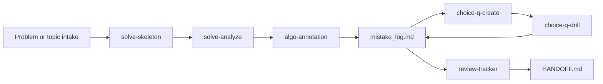

# pass-llm-with-llm

> LLM-powered exam-prep harness for AI and algorithm written exams.


[中文文档](README_CN.md)

## Why Try It

- **Exam practice as a loop**: algorithm practice, choice-question drills, mistake logging, and review planning stay connected.
- **Interactive choice-question drill**: with the Claude Code VS Code extension, `choice-q-drill` can present one question at a time, score answers immediately, and feed mistakes back into future practice.
- **Algorithm Skill Pipeline**: `solve-skeleton` -> `solve-analyze` -> `algo-annotation` turns an OJ problem into a tested, diagnosed, annotated solution.
- **Local-first by default**: Markdown files remain readable and versionable; the bundled `exam-memory` MCP server is optional enhancement, not a hard dependency.

This is an **execution harness**, not a generic knowledge base or a pile of solutions. It is built to help a learner keep moving through the daily loop: intake -> practice -> record -> review -> handoff.

## Quick Start

### Prerequisites

- [Claude Code](https://docs.anthropic.com/en/docs/claude-code) CLI or VS Code extension.
- Python 3.10+ only if you want to enable the optional `exam-memory` MCP server.

The VS Code extension is recommended for the best interactive quiz experience. If interactive quiz tools are unavailable, `choice-q-drill` can still score compact chat answers such as `1A 2BD 3C` and return update blocks. The core Markdown and Skill workflow can be used without enabling MCP.

### Install

```bash
git clone https://github.com/Tenstu/pass-llm-with-llm.git
cd pass-llm-with-llm
```

### First Run

1. Open the repository in Claude Code.
2. Say `init` or `初始化` to run the onboarding guide.
3. Read [START_HERE.md](START_HERE.md) for the session bootstrap order.
4. Configure your target in [HANDOFF.md](HANDOFF.md) if needed.

### Zero-Dependency Path

For a temporary or first-run setup, you can use the harness with only Markdown files:

1. Fill [HANDOFF.md](HANDOFF.md) with target, exam date, and daily time.
2. Create today's `shared/daily/YYYY-MM-DD.md`, or ask the agent to return a `DAILY_PROBLEM_LOG_APPEND` block.
3. Use `targets/{target}/exam_config.md` for question counts and scoring.
4. Record mistakes in `targets/{target}/mistake_log.md`, or save the returned `MISTAKE_LOG_APPEND` / `CHOICE_ROUND_SUMMARY` / `HANDOFF_UPDATE` blocks.

Lite/Portable Mode is for temporary environments, first-run startup, and recovery. It is not suitable as the only long-term workflow because cross-session retrieval, automatic error-count merging, and profile updates are unavailable. For sustained prep, move to Local Markdown Mode or enable Full MCP Mode.

### Daily Use

```text
Algorithm problem:
  Skill(skill="solve-skeleton")
  -> fill solve()
  -> Skill(skill="solve-analyze") when WA/TLE or unsure
  -> Skill(skill="algo-annotation")

Choice-question practice:
  Skill(skill="choice-q-create")
  -> Skill(skill="choice-q-drill")
  -> mistakes feed the next drill

Progress check:
  Skill(skill="review-tracker")
```

### Runtime Modes

| Mode | Dependencies | Best For |
|------|--------------|----------|
| Full MCP Mode | Repository Markdown + optional `exam-memory` MCP | Long-running prep with cross-session retrieval and profile updates |
| Local Markdown Mode | Repository files only | Default low-friction workflow |
| Stateless Lite Mode | Current chat + returned append blocks | Temporary machines, new-user demos, recovery when files/tools are unavailable |

## Core Loop



The important part is the feedback path: mistakes recorded today become tomorrow's hints, drills, and review priorities.

## Core Features

| Feature | What It Does |
|---------|--------------|
| Algorithm Skill Pipeline | Selects ACM/OJ skeletons, diagnoses solutions, and adds Chinese `# [防错]` annotations. |
| Interactive Choice Drill | Generates targeted choice questions, presents them interactively in Claude Code VS Code extension, scores answers, and records weak topics. |
| Local Mistake Loop | Keeps WA/TLE causes and choice-question mistakes in target-specific Markdown logs. |
| Optional exam-memory MCP | Adds cross-session experience persistence, error counting, and user profile retrieval. |
| Question Bank and Source Retrieval | Multi-source index across `bank/` and `experiences/`, manifest-aligned sources, `QuestionBank.search()` with lexical and hybrid retrieval. |
| Review Tracker | Aggregates progress, weak topics, readiness trends, and today's must-do list. |
| Target-Aware Layout | Stores reusable material under `shared/` and exam-specific material under `targets/{target}/`. |

## Repository Topics

Suggested GitHub topics for discoverability:

```text
education, llm, exam-prep, algorithm, interactive-quiz, claude-code,
vscode-extension, mcp, ai-agents, python-oj, study-tools,
spaced-repetition, local-first, knowledge-retrieval
```

## Agent and MCP Entry Points

| Need | Entry Point |
|------|-------------|
| Session bootstrap | [START_HERE.md](START_HERE.md) |
| Project rules and skill routing | [AGENTS.md](AGENTS.md) |
| Current handoff and target setup | [HANDOFF.md](HANDOFF.md) |
| Skill definitions | `skills/` |
| Target-specific exam material | `targets/{target}/` |
| Shared MCP server and retrieval helpers | `shared/exam_memory/` |
| Contribution rules | [CONTRIBUTING.md](CONTRIBUTING.md) |

## Optional Integrations

The harness works in local Markdown mode first. These integrations add memory or retrieval when you want more continuity.

| Tool | Role | Bundled? |
|------|------|:---:|
| `exam-memory` MCP | Cross-session mistake and experience persistence, user profile retrieval, optional semantic search support. | Yes |
| ChatMem | Conversation-level recall for handoffs, continuation, and project history. | No |
| MemPalace | Long-term structured knowledge storage and knowledge graph workflows. | No |
| [OneFind](https://github.com/iawnfoanaowt/OneFind) | External local knowledge retrieval for existing Obsidian notes, Zotero libraries, or folders. | No |

`exam-memory` is the write-through exam-prep memory layer in this project. OneFind is best treated as a read-oriented external retrieval layer for knowledge you already keep elsewhere. They are complementary rather than substitutes.

To enable the bundled MCP server, install the minimal Python dependencies and register `.mcp.json` with a stdio command that runs `shared/exam_memory/server.py`. Copy `.mcp.example.json` to `.mcp.json` and adjust the Python path. Optionally copy `.env.example` to `.env` for centralized key management. If MCP is unavailable, the Skills fall back to local Markdown files; if files cannot be written, they return append blocks and warn that Lite/Portable Mode should remain temporary.

### Optional Capability Setup

The base harness does not need an online model, embedding model, GPU, or MCP server. These are optional enhancements:

| Capability | Install | Configure |
|------------|---------|-----------|
| `exam-memory` MCP | `cd shared/exam_memory` then `pip install .` | copy `.mcp.example.json` to your local `.mcp.json` and adjust paths if needed |
| Semantic retrieval with local embeddings | `pip install ".[embed]"` | default local model is `BAAI/bge-m3`; first use downloads it through Hugging Face cache |
| Question generation LLM | `pip install ".[generate]"` | set `EXAM_MEMORY_LLM_MODEL`; there is no default online model |

`BAAI/bge-m3` currently runs CPU-only in this project. It does not require CUDA, a GPU, or NVIDIA drivers. If `sentence-transformers` is missing or the model cannot be downloaded, CRUD, manual question entry, Markdown logs, and lexical search still work; only semantic retrieval is unavailable until dependencies and cache are ready.

After enabling embeddings, rebuild local indexes when needed:

```bash
cd shared/exam_memory
python -m exam_memory.rebuild_index --force
```

By default the rebuild scans both `experiences/` and `bank/`. Use `--bank-only` to rebuild only the question-bank index.

For offline use, cache the model once on a machine with network access before going offline. Future provider configuration will also support pointing `EXAM_MEMORY_EMBEDDING_MODEL` at a local model directory.

Question generation is separate from embeddings. `QuestionBank` reads only `EXAM_MEMORY_LLM_MODEL` for chat completion, and embedding settings are never used to generate questions.

LiteLLM examples:

```bash
# DeepSeek
export EXAM_MEMORY_LLM_MODEL=deepseek/deepseek-chat
export DEEPSEEK_API_KEY=...

# Qwen through DashScope
export EXAM_MEMORY_LLM_MODEL=dashscope/qwen-plus
export DASHSCOPE_API_KEY=...

# OpenAI-compatible local or hosted endpoint
export EXAM_MEMORY_LLM_MODEL=openai/local-qwen
export OPENAI_API_BASE=http://localhost:8000/v1
export OPENAI_API_KEY=local-placeholder
```

### Troubleshooting

| Symptom | Likely Cause | Fix |
|---------|--------------|-----|
| `LLM 不可用：未配置 EXAM_MEMORY_LLM_MODEL` | no question-generation model configured | set `EXAM_MEMORY_LLM_MODEL`, or use manual/local question workflows |
| `LLM 不可用：litellm 未安装` | generation extra missing | run `pip install ".[generate]"` in `shared/exam_memory` |
| embedding import/download failure | `sentence-transformers` missing, network unavailable, or Hugging Face cache empty | run `pip install ".[embed]"`, cache the model, or continue with lexical/local Markdown mode |
| stale or incompatible vector index | local `vectorstore/` was built with a different embedding setup | rebuild with `python -m exam_memory.rebuild_index --force` |
| API key error | provider key missing or not exported in the active shell | set the provider-specific key in your local `.env` or shell environment |

## Skill Reference

| Skill | Purpose | MCP Required |
|-------|---------|:---:|
| `init-guide` | First-run onboarding: exam target, date, scope, user profiling. | Optional |
| `solve-skeleton` | Algorithm problem skeleton generation with ACM/OJ input patterns. | No |
| `solve-analyze` | Solution diagnosis, standard-solution comparison, root-cause tagging. | Optional |
| `algo-annotation` | Chinese comments, `# [防错]` markers, invariant summary. | No |
| `choice-q-create` | Targeted choice-question generation from exam config, weak topics, and sources. | Optional |
| `choice-q-drill` | Interactive quiz, immediate scoring, mistake feedback. | Optional |
| `exam-assistant` | Exam assistant with experience retrieval and profile awareness. | Optional |
| `review-tracker` | Progress aggregation, readiness trend, and daily action list. | No |

## Directory Structure

```text
pass-llm-with-llm/
  AGENTS.md                    # Agent execution contract and skill routing
  START_HERE.md                # Session bootstrap guide
  HANDOFF.md                   # Session handoff and target setup
  README.md                    # English documentation
  README_CN.md                 # Chinese documentation

  skills/                      # Claude Code Skill definitions
    solve-skeleton/            # Algorithm skeleton templates
    solve-analyze/             # Solution diagnosis workflow
    algo-annotation.md         # Annotated solution output
    choice-q-create.md         # Choice-question generation
    choice-q-drill.md          # Interactive drill workflow
    exam-assistant.md          # MCP-aware exam assistant
    review-tracker.md          # Progress aggregation

  targets/                     # Target-specific exam content
    ai-lab/
    pdd-algo/

  shared/                      # Cross-target material
    cheatsheets/
    daily/
    exam_memory/               # Bundled MCP server and experience store
    progress/
    prompts/
```

## Adapting to Other Exams

1. Create or copy a target under `targets/{target}/`.
2. Update `targets/{target}/exam_config.md` with question counts, scoring, and timing.
3. Put exam-specific patterns under `targets/{target}/sources/`.
4. Put target-specific notes under `targets/{target}/cheatsheets/`; keep reusable notes under `shared/cheatsheets/`.
5. Update [HANDOFF.md](HANDOFF.md) so future sessions know the active target.

## Roadmap

### Current

- Algorithm Skill Pipeline for ACM/OJ practice.
- Interactive choice-question drill with the Claude Code VS Code extension.
- Local Markdown mistake logs and progress tracking.
- Optional `exam-memory` MCP persistence.

### Next

- Stronger review scheduling from mistakes and weak topics.
- Semantic dedup, difficulty calibration, and retrieval evaluation reports.
- GitHub / Web connectors for external question sources.
- More reusable target exam templates.

### Later

- Multimodal problem intake from screenshots.
- Cross-device sync for experience files.
- Analytics dashboard for strengths, weak topics, and review plans.

## Contributing

Contributions are welcome when they improve the exam-prep loop. Good first areas include:

- new target templates under `targets/{target}/`;
- stronger Skill prompts or references under `skills/`;
- reusable cheatsheets under `shared/cheatsheets/`;
- documentation, examples, and lightweight test coverage.

See [CONTRIBUTING.md](CONTRIBUTING.md) for path rules and PR expectations.

## Acknowledgements

This project is inspired in part by [OneFind](https://github.com/iawnfoanaowt/OneFind), especially its local-first retrieval orientation and the idea that agent-facing tools should make personal knowledge easier to search and reuse. OneFind is an external project and optional integration; this repository does not redistribute OneFind code or present itself as an official OneFind extension.

## License

[MIT](LICENSE)
