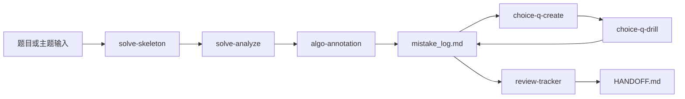

# pass-llm-with-llm

> 面向 AI/算法笔试的 LLM-powered exam-prep harness。


[English](README.md)

## 为什么值得试

- **把备考变成闭环**：算法题、选择题、错题记录、复盘计划串在一起，不再散落成一堆笔记。
- **交互式选择题训练**：配合 Claude Code VS Code 扩展，`choice-q-drill` 可以逐题呈现、即时评分，并把错题回流到后续练习。
- **算法 Skill Pipeline**：`solve-skeleton` -> `solve-analyze` -> `algo-annotation`，从 OJ 题目到诊断、注释、避坑标记形成完整链路。
- **默认本地优先**：Markdown 文件可读、可 Git 管理；项目自带的 `exam-memory` MCP server 是增强项，不是硬依赖。

这是一个**备考执行 harness**，不是普通题解仓库，也不是泛知识库。它的目标是让学习者每天稳定走完：输入目标 -> 刷题练习 -> 记录错误 -> 复盘改进 -> 交接下一轮。

## 快速开始

### 前置条件

- [Claude Code](https://docs.anthropic.com/en/docs/claude-code) CLI 或 VS Code 扩展。
- Python 3.10+ 仅在启用可选 `exam-memory` MCP server 时需要。

推荐使用 VS Code 扩展获得最佳交互答题体验。如果交互式 quiz 工具不可用，`choice-q-drill` 仍可评分聊天答案串，例如 `1A 2BD 3C`，并返回需要落盘的 update blocks。核心 Markdown 与 Skill 流程不依赖 MCP。

### 安装

```bash
git clone https://github.com/Tenstu/pass-llm-with-llm.git
cd pass-llm-with-llm
```

### 首次使用

1. 在 Claude Code 中打开仓库。
2. 说 `init` 或 `初始化` 启动配置导引。
3. 阅读 [START_HERE.md](START_HERE.md) 了解 session 启动顺序。
4. 如有需要，更新 [HANDOFF.md](HANDOFF.md) 中的目标考试与每日投入时间。

### 零依赖路径

临时环境或首次试用时，只用 Markdown 也能走通最小闭环：

1. 在 [HANDOFF.md](HANDOFF.md) 填写目标、考试日期和每日投入时间。
2. 创建今天的 `shared/daily/YYYY-MM-DD.md`；不能写文件时，让 agent 返回 `DAILY_PROBLEM_LOG_APPEND`。
3. 用 `targets/{target}/exam_config.md` 确定题量、分值和时间。
4. 把错题写入 `targets/{target}/mistake_log.md`，或保存返回的 `MISTAKE_LOG_APPEND` / `CHOICE_ROUND_SUMMARY` / `HANDOFF_UPDATE`。

Lite/Portable Mode 适合临时环境、新用户启动和故障恢复，不建议长期作为唯一工作流；它缺少跨会话语义检索、错误频率自动合并和用户画像更新。长期备考至少使用 Local Markdown Mode，最好启用 Full MCP Mode。

### 日常使用

```text
算法题：
  Skill(skill="solve-skeleton")
  -> 填写 solve()
  -> WA/TLE 或不确定时调用 Skill(skill="solve-analyze")
  -> Skill(skill="algo-annotation")

选择题：
  Skill(skill="choice-q-create")
  -> Skill(skill="choice-q-drill")
  -> 错题回流到下一轮练习

进度检查：
  Skill(skill="review-tracker")
```

### 运行模式

| Mode | 依赖 | 适用场景 |
|------|------|----------|
| Full MCP Mode | 仓库 Markdown + 可选 `exam-memory` MCP | 长期备考，需跨会话检索和画像更新 |
| Local Markdown Mode | 仓库文件 | 默认低门槛工作流 |
| Stateless Lite Mode | 当前聊天 + 返回的 append blocks | 临时机器、新用户演示、文件/工具不可用时恢复 |

## 核心闭环



关键不是“生成一次答案”，而是让今天记录的错误变成明天的提示、练习和复盘优先级。

## 核心特性

| 功能 | 作用 |
|------|------|
| 算法 Skill Pipeline | 选择 ACM/OJ 骨架，诊断解法，生成中文 `# [防错]` 注释。 |
| 交互式选择题训练 | 生成定向选择题，在 Claude Code VS Code 扩展中逐题作答、即时评分、记录弱点。 |
| 本地错题闭环 | 将 WA/TLE 原因和选择题错误保存在目标目录下的 Markdown 日志中。 |
| 可选 exam-memory MCP | 增加跨会话经验持久化、错误计数和用户画像读取。 |
| 题库与知识源检索 | 多源索引覆盖 `bank/` 与 `experiences/`，manifest 对齐来源，`QuestionBank.search()` 支持词法与混合检索。 |
| 复习进度追踪 | 汇总进度、薄弱主题、就绪度趋势和今日必做清单。 |
| 目标感知目录 | 可复用资料放在 `shared/`，目标考试资料放在 `targets/{target}/`。 |

## 仓库 Topics 建议

建议在 GitHub 仓库设置这些 topics，提升搜索与推荐命中：

```text
education, llm, exam-prep, algorithm, interactive-quiz, claude-code,
vscode-extension, mcp, ai-agents, python-oj, study-tools,
spaced-repetition, local-first, knowledge-retrieval
```

## Agent / MCP 入口

| 需求 | 入口 |
|------|------|
| session 启动 | [START_HERE.md](START_HERE.md) |
| 项目规则与 Skill 路由 | [AGENTS.md](AGENTS.md) |
| 当前交接与目标配置 | [HANDOFF.md](HANDOFF.md) |
| Skill 定义 | `skills/` |
| 目标考试资料 | `targets/{target}/` |
| 共享 MCP server 与检索辅助 | `shared/exam_memory/` |
| 贡献规范 | [CONTRIBUTING.md](CONTRIBUTING.md) |

## 可选集成

本项目优先保证本地 Markdown 模式可用。以下集成用于增加记忆、检索和连续性。

| 工具 | 作用 | 是否自带 |
|------|------|:---:|
| `exam-memory` MCP | 跨会话错题经验持久化、用户画像读取、可选语义检索支持。 | 是 |
| ChatMem | 对话级记忆，用于交接、继续、项目历史回忆。 | 否 |
| MemPalace | 长期结构化知识存储与知识图谱工作流。 | 否 |
| [OneFind](https://github.com/iawnfoanaowt/OneFind) | 外部本地知识库检索，可检索已有 Obsidian、Zotero 或本地文件夹。 | 否 |

`exam-memory` 是本项目内负责写入备考经验的记忆层。OneFind 更适合作为只读的外部知识检索层，用来连接你已经维护在别处的学习资料。两者互补，不互相替代。

如需启用项目自带 MCP server，安装最小 Python 依赖，复制 `.mcp.example.json` 为本机 `.mcp.json`，复制 `.env.example` 为本机 `.env`，在 `.mcp.json` 中注册运行 `shared/exam_memory/server.py` 的 stdio 命令。MCP 不可用时，Skills 会自动回退到本地 Markdown 文件；文件也不可写时，会返回 append blocks，并提醒 Lite/Portable Mode 只适合临时使用。

### 可选增强能力配置

基础 harness 不需要在线模型、embedding 模型、GPU 或 MCP server。下面这些只是在需要连续记忆、语义检索或自动出题时开启的增强项：

| 能力 | 安装方式 | 配置方式 |
|------|----------|----------|
| `exam-memory` MCP | `cd shared/exam_memory` 后运行 `pip install .` | 复制 `.mcp.example.json` 为本机 `.mcp.json`，必要时调整路径 |
| 本地 embedding 语义检索 | `pip install ".[embed]"` | 当前默认本地模型为 `BAAI/bge-m3`，首次使用会走 Hugging Face 缓存下载 |
| 在线出题 LLM | `pip install ".[generate]"` | 设置 `EXAM_MEMORY_LLM_MODEL`；项目不提供默认在线模型 |

本项目当前的 `BAAI/bge-m3` 路径是 CPU-only，不要求 CUDA、GPU 或 NVIDIA 驱动。未安装 `sentence-transformers` 或模型下载失败时，题库 CRUD、手动录题、Markdown 错题日志和词法检索仍可用，只是语义检索暂不可用。

启用 embedding 后，可按需重建本地索引：

```bash
cd shared/exam_memory
python -m exam_memory.rebuild_index --force
```

默认重建会扫描 `experiences/` 和 `bank/` 两个目录。使用 `--bank-only` 可只重建题库索引。

离线使用前，建议先在有网络的环境中完成模型缓存。后续 provider 配置落地后，也会支持通过 `EXAM_MEMORY_EMBEDDING_MODEL` 指向本地模型目录。

出题 LLM 与 embedding 是两套接口：`QuestionBank` 只从 `EXAM_MEMORY_LLM_MODEL` 读取 chat completion 模型；embedding 配置不会被拿来生成题目。

LiteLLM 配置示例：

```bash
# DeepSeek
export EXAM_MEMORY_LLM_MODEL=deepseek/deepseek-chat
export DEEPSEEK_API_KEY=...

# Qwen / 通义千问（DashScope）
export EXAM_MEMORY_LLM_MODEL=dashscope/qwen-plus
export DASHSCOPE_API_KEY=...

# OpenAI-compatible 本地或托管服务
export EXAM_MEMORY_LLM_MODEL=openai/local-qwen
export OPENAI_API_BASE=http://localhost:8000/v1
export OPENAI_API_KEY=local-placeholder
```

### 常见故障

| 现象 | 常见原因 | 处理方式 |
|------|----------|----------|
| `LLM 不可用：未配置 EXAM_MEMORY_LLM_MODEL` | 未配置出题模型 | 设置 `EXAM_MEMORY_LLM_MODEL`，或继续使用手动/本地题库流程 |
| `LLM 不可用：litellm 未安装` | 未安装出题依赖 | 在 `shared/exam_memory` 下运行 `pip install ".[generate]"` |
| embedding 导入或下载失败 | 缺少 `sentence-transformers`、网络不可用或 HF 缓存为空 | 运行 `pip install ".[embed]"`，提前缓存模型，或先使用词法检索/Markdown 模式 |
| 向量索引过期或不兼容 | `vectorstore/` 由不同 embedding 配置生成 | 运行 `python -m exam_memory.rebuild_index --force` 重建 |
| API key 报错 | 当前 shell 或 `.env` 未设置供应商密钥 | 在本机 `.env` 或 shell 环境中设置对应 provider key |

## Skill 一览

| Skill | 用途 | 是否必须 MCP |
|-------|------|:---:|
| `init-guide` | 首次使用导引：考试目标、日期、范围、用户画像。 | 可选 |
| `solve-skeleton` | 生成算法题 ACM/OJ 输入输出骨架。 | 否 |
| `solve-analyze` | 解题诊断、标准解法对比、根因标签。 | 可选 |
| `algo-annotation` | 中文注释、`# [防错]` 标记、核心不变量总结。 | 否 |
| `choice-q-create` | 根据考试配置、弱点和资料生成定向选择题。 | 可选 |
| `choice-q-drill` | 交互答题、即时评分、错题反馈。 | 可选 |
| `exam-assistant` | 带经验检索和用户画像意识的考试助手。 | 可选 |
| `review-tracker` | 进度汇总、就绪度趋势、每日行动清单。 | 否 |

## 目录结构

```text
pass-llm-with-llm/
  AGENTS.md                    # Agent 执行契约与 Skill 路由
  START_HERE.md                # Session 启动指南
  HANDOFF.md                   # Session 交接与目标配置
  README.md                    # 英文文档
  README_CN.md                 # 中文文档

  skills/                      # Claude Code Skill 定义
    solve-skeleton/            # 算法骨架模板
    solve-analyze/             # 解题诊断流程
    algo-annotation.md         # 注释与防错标记
    choice-q-create.md         # 选择题生成
    choice-q-drill.md          # 交互式刷题
    exam-assistant.md          # MCP-aware 考试助手
    review-tracker.md          # 进度汇总

  targets/                     # 目标考试专属内容
    ai-lab/
    pdd-algo/

  shared/                      # 跨目标共享内容
    cheatsheets/
    daily/
    exam_memory/               # 自带 MCP server 与经验库
    progress/
    prompts/
```

## 适配其他考试

1. 在 `targets/{target}/` 下创建或复制目标目录。
2. 更新 `targets/{target}/exam_config.md` 中的题数、分值和时间。
3. 将考试题型分析放入 `targets/{target}/sources/`。
4. 将目标专属资料放入 `targets/{target}/cheatsheets/`，可复用资料放入 `shared/cheatsheets/`。
5. 更新 [HANDOFF.md](HANDOFF.md)，让后续 session 知道当前活跃目标。

## 路线图

### Current

- 面向 ACM/OJ 的算法 Skill Pipeline。
- 基于 Claude Code VS Code 扩展的交互式选择题训练。
- 本地 Markdown 错题日志与进度追踪。
- 可选 `exam-memory` MCP 持久化。

### Next

- 从错题和薄弱主题生成更强的复习调度。
- 语义去重、难度校准和检索评估报告。
- GitHub / Web 外部题库连接器。
- 更多可复用目标考试模板。

### Later

- 从截图输入题目的多模态能力。
- 经验文件跨设备同步。
- 强弱项、薄弱主题与复习计划分析仪表盘。

## 参与贡献

欢迎贡献能改善备考闭环的内容。适合切入的方向包括：

- `targets/{target}/` 下的新考试目标模板；
- `skills/` 下的 Skill prompt 或参考资料改进；
- `shared/cheatsheets/` 下的通用速记资料；
- 文档、示例和轻量测试覆盖。

路径规则和 PR 要求见 [CONTRIBUTING.md](CONTRIBUTING.md)。

## 致谢

本项目部分思路受到 [OneFind](https://github.com/iawnfoanaowt/OneFind) 启发，尤其是本地优先检索、Agent 可用资料组织、让个人知识更容易被搜索和复用等方向。OneFind 是外部项目和可选集成；本仓库不分发 OneFind 代码，也不表示自己是 OneFind 的官方扩展。

## License

[MIT](LICENSE)
